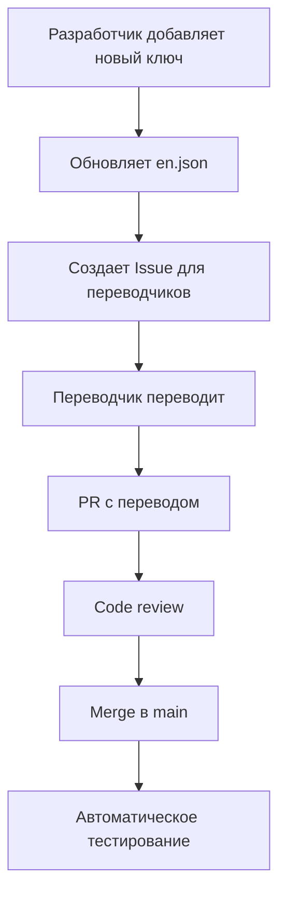

# 2.1.6 Детальное планирование интернационализации (i18n)

## Статус: ✅ Завершено
**Дата создания**: 19 сентября 2025
**Версия документа**: 1.0
**Ответственный**: voleum

---

## 📋 Обзор

Детальное планирование интернационализации (i18n) для кросплатформенной игры Судоку, включая структуру файлов, workflow переводов, технические детали реализации и планирование RTL поддержки.

---

## 🌍 Языковая поддержка

### Этап 1: MVP (Минимальная поддержка)
- **🇷🇺 Русский (ru)** - основной язык
- **🇺🇸 Английский (en)** - международный язык

### Этап 2: Расширение (Post-launch)
- **🇩🇪 Немецкий (de)** - крупный европейский рынок
- **🇫🇷 Французский (fr)** - европейский рынок
- **🇪🇸 Испанский (es)** - латиноамериканский рынок
- **🇨🇳 Китайский упрощенный (zh-CN)** - азиатский рынок

### Этап 3: RTL поддержка (Будущее)
- **🇸🇦 Арабский (ar)** - RTL язык
- **🇮🇱 Иврит (he)** - RTL язык

---

## 📁 Структура файлов локализации

### Детальная структура каталогов:

```
src/
└── localization/
    ├── index.ts                    # Основной экспорт i18n
    ├── i18n.ts                     # Конфигурация i18next
    ├── types.ts                    # TypeScript типы для переводов
    ├── utils/                      # Утилиты локализации
    │   ├── dateFormatting.ts      # Форматирование дат
    │   ├── numberFormatting.ts    # Форматирование чисел
    │   ├── pluralization.ts       # Правила плюрализации
    │   └── languageDetection.ts   # Определение языка
    ├── hooks/                      # React hooks для i18n
    │   ├── useTranslation.ts      # Кастомный хук переводов
    │   ├── useLocale.ts           # Хук управления локалью
    │   └── useNumberFormat.ts     # Хук форматирования чисел
    ├── locales/                    # Файлы переводов
    │   ├── en/                    # Английский
    │   │   ├── common.json        # Общие переводы
    │   │   ├── game.json          # Игровые переводы
    │   │   ├── ui.json            # UI элементы
    │   │   ├── menu.json          # Меню и навигация
    │   │   ├── settings.json      # Настройки
    │   │   ├── achievements.json  # Достижения
    │   │   ├── tutorial.json      # Обучение
    │   │   └── errors.json        # Ошибки и сообщения
    │   ├── ru/                    # Русский (аналогичная структура)
    │   │   ├── common.json
    │   │   ├── game.json
    │   │   ├── ui.json
    │   │   ├── menu.json
    │   │   ├── settings.json
    │   │   ├── achievements.json
    │   │   ├── tutorial.json
    │   │   └── errors.json
    │   └── index.ts               # Импорт всех локалей
    ├── rtl/                       # RTL поддержка (будущее)
    │   ├── styles.ts              # RTL стили
    │   ├── detection.ts           # Определение RTL
    │   └── transforms.ts          # Трансформации для RTL
    └── resources/                 # Ресурсы локализации
        ├── fonts/                 # Локализованные шрифты
        ├── images/                # Локализованные изображения
        └── audio/                 # Локализованные звуки
```

---

## 🔧 Техническая реализация

### Основная конфигурация i18next

```typescript
// src/localization/i18n.ts
import i18n from 'i18next';
import { initReactI18next } from 'react-i18next';
import { NativeModules, Platform } from 'react-native';

// Импорт переводов
import enTranslations from './locales/en';
import ruTranslations from './locales/ru';

// Определение языка устройства
const getDeviceLanguage = (): string => {
  let locale = 'en'; // fallback

  if (Platform.OS === 'ios') {
    locale = NativeModules.SettingsManager?.settings?.AppleLocale
      || NativeModules.SettingsManager?.settings?.AppleLanguages?.[0]
      || 'en';
  } else {
    locale = NativeModules.I18nManager?.localeIdentifier || 'en';
  }

  return locale.substring(0, 2); // Получаем код языка
};

const supportedLanguages = ['en', 'ru'];
const fallbackLanguage = 'en';

i18n
  .use(initReactI18next)
  .init({
    resources: {
      en: enTranslations,
      ru: ruTranslations,
    },
    lng: getDeviceLanguage(),
    fallbackLng: fallbackLanguage,
    supportedLngs: supportedLanguages,

    // Namespace configuration
    defaultNS: 'common',
    ns: ['common', 'game', 'ui', 'menu', 'settings', 'achievements', 'tutorial', 'errors'],

    interpolation: {
      escapeValue: false, // React already escapes
    },

    // Debug mode for development
    debug: __DEV__,

    // Caching
    cache: {
      enabled: true,
    },

    // Pluralization
    pluralSeparator: '_',
    contextSeparator: '_',
  });

export default i18n;
```

### TypeScript типы для переводов

```typescript
// src/localization/types.ts
export interface TranslationResource {
  common: typeof import('./locales/en/common.json');
  game: typeof import('./locales/en/game.json');
  ui: typeof import('./locales/en/ui.json');
  menu: typeof import('./locales/en/menu.json');
  settings: typeof import('./locales/en/settings.json');
  achievements: typeof import('./locales/en/achievements.json');
  tutorial: typeof import('./locales/en/tutorial.json');
  errors: typeof import('./locales/en/errors.json');
}

export type SupportedLanguage = 'en' | 'ru' | 'de' | 'fr' | 'es' | 'zh-CN';
export type RTLLanguage = 'ar' | 'he';

export interface LocaleConfig {
  code: SupportedLanguage;
  name: string;
  nativeName: string;
  isRTL: boolean;
  dateFormat: string;
  numberFormat: {
    decimal: string;
    thousands: string;
  };
}

export interface GameTranslationKeys {
  // Уровни сложности
  difficulty: {
    easy: string;
    medium: string;
    hard: string;
    expert: string;
  };

  // Игровые действия
  actions: {
    newGame: string;
    continueGame: string;
    pauseGame: string;
    resumeGame: string;
    giveUp: string;
    hint: string;
    undo: string;
    redo: string;
    clear: string;
    notes: string;
  };

  // Состояния игры
  status: {
    inProgress: string;
    completed: string;
    paused: string;
    failed: string;
  };

  // Временные форматы
  time: {
    seconds: string;
    minutes: string;
    hours: string;
  };
}
```

---

## 📝 Структура переводов

### Пример: game.json (русский)

```json
{
  "difficulty": {
    "easy": "Легкий",
    "medium": "Средний",
    "hard": "Сложный",
    "expert": "Эксперт"
  },

  "actions": {
    "newGame": "Новая игра",
    "continueGame": "Продолжить игру",
    "pauseGame": "Пауза",
    "resumeGame": "Продолжить",
    "giveUp": "Сдаться",
    "hint": "Подсказка",
    "undo": "Отменить",
    "redo": "Повторить",
    "clear": "Очистить",
    "notes": "Заметки"
  },

  "status": {
    "inProgress": "В процессе",
    "completed": "Завершена",
    "paused": "На паузе",
    "failed": "Провалена"
  },

  "time": {
    "seconds_zero": "{{count}} секунд",
    "seconds_one": "{{count}} секунда",
    "seconds_few": "{{count}} секунды",
    "seconds_many": "{{count}} секунд",
    "minutes_zero": "{{count}} минут",
    "minutes_one": "{{count}} минута",
    "minutes_few": "{{count}} минуты",
    "minutes_many": "{{count}} минут",
    "hours_zero": "{{count}} часов",
    "hours_one": "{{count}} час",
    "hours_few": "{{count}} часа",
    "hours_many": "{{count}} часов"
  },

  "completion": {
    "congratulations": "Поздравляем!",
    "timeRecord": "Новый рекорд времени: {{time}}",
    "perfectGame": "Идеальная игра без ошибок!",
    "hintsUsed": "Использовано подсказок: {{count}}",
    "share": "Поделиться результатом"
  },

  "tutorial": {
    "welcome": "Добро пожаловать в Судоку!",
    "step1": "Заполните каждую ячейку цифрой от 1 до 9",
    "step2": "В каждой строке должны быть все цифры от 1 до 9",
    "step3": "В каждом столбце должны быть все цифры от 1 до 9",
    "step4": "В каждом блоке 3×3 должны быть все цифры от 1 до 9",
    "tryIt": "Попробуйте сами!",
    "good": "Отлично!",
    "hint": "Подсказка: посмотрите на блок в верхнем левом углу"
  }
}
```

---

## 🎯 Workflow переводов

### 1. Процесс добавления новых переводов



### 2. Автоматизация переводов

```bash
# scripts/i18n-check.js - проверка отсутствующих переводов
npm run i18n:check

# scripts/i18n-extract.js - извлечение новых ключей из кода
npm run i18n:extract

# scripts/i18n-validate.js - валидация JSON файлов
npm run i18n:validate
```

### 3. Инструменты для переводчиков

- **Локальная среда**: простая веб-страница для редактирования переводов
- **Валидация**: автоматическая проверка формата и плюрализации
- **Контекст**: скриншоты и описания для каждого ключа

---

## 📱 Адаптация под платформы

### iOS специфика

```typescript
// src/localization/utils/iosLocalization.ts
import { NativeModules } from 'react-native';

export const getIOSPreferredLanguages = (): string[] => {
  return NativeModules.SettingsManager?.settings?.AppleLanguages || ['en'];
};

export const getIOSNumberFormatting = () => {
  // Использование iOS NSNumberFormatter
  return {
    decimal: NativeModules.SettingsManager?.settings?.AppleLocale?.includes(',') ? ',' : '.',
    thousands: NativeModules.SettingsManager?.settings?.AppleLocale?.includes(',') ? '.' : ','
  };
};
```

### Android специфика

```typescript
// src/localization/utils/androidLocalization.ts
import { NativeModules } from 'react-native';

export const getAndroidLocale = (): string => {
  return NativeModules.I18nManager?.localeIdentifier || 'en-US';
};

export const getAndroidTimeFormat = (): '12h' | '24h' => {
  // Определение формата времени Android
  return NativeModules.SettingsManager?.is24Hour ? '24h' : '12h';
};
```

---

## 🔄 RTL поддержка (планирование)

### Архитектура RTL

```typescript
// src/localization/rtl/detection.ts
export const isRTLLanguage = (language: string): boolean => {
  const rtlLanguages = ['ar', 'he', 'fa', 'ur'];
  return rtlLanguages.includes(language);
};

// src/localization/rtl/styles.ts
export const getRTLStyles = (isRTL: boolean) => ({
  container: {
    flexDirection: isRTL ? 'row-reverse' : 'row',
  },
  text: {
    textAlign: isRTL ? 'right' : 'left',
    writingDirection: isRTL ? 'rtl' : 'ltr',
  },
});
```

### React Native RTL поддержка

```typescript
// App.tsx - основная настройка RTL
import { I18nManager } from 'react-native';
import { getCurrentLanguage } from './src/localization';

useEffect(() => {
  const currentLang = getCurrentLanguage();
  const shouldBeRTL = isRTLLanguage(currentLang);

  if (I18nManager.isRTL !== shouldBeRTL) {
    I18nManager.forceRTL(shouldBeRTL);
    // Требуется перезапуск приложения
    RNRestart.Restart();
  }
}, []);
```

---

## 📊 Форматирование данных

### Даты и время

```typescript
// src/localization/utils/dateFormatting.ts
import { format } from 'date-fns';
import { ru, enUS, de, fr, es, zhCN } from 'date-fns/locale';

const locales = {
  ru: ru,
  en: enUS,
  de: de,
  fr: fr,
  es: es,
  'zh-CN': zhCN,
};

export const formatDate = (date: Date, formatString: string, language: string) => {
  const locale = locales[language] || locales.en;
  return format(date, formatString, { locale });
};

export const formatGameTime = (seconds: number, language: string): string => {
  const hours = Math.floor(seconds / 3600);
  const minutes = Math.floor((seconds % 3600) / 60);
  const secs = seconds % 60;

  // Используем локализованные форматы времени
  if (hours > 0) {
    return `${hours}:${minutes.toString().padStart(2, '0')}:${secs.toString().padStart(2, '0')}`;
  }
  return `${minutes}:${secs.toString().padStart(2, '0')}`;
};
```

### Числа и метрики

```typescript
// src/localization/utils/numberFormatting.ts
export const formatNumber = (number: number, language: string): string => {
  return new Intl.NumberFormat(language).format(number);
};

export const formatGameStats = (stats: GameStats, language: string) => {
  return {
    gamesPlayed: formatNumber(stats.gamesPlayed, language),
    winRate: `${(stats.winRate * 100).toFixed(1)}%`,
    averageTime: formatGameTime(stats.averageTime, language),
    bestTime: formatGameTime(stats.bestTime, language),
  };
};
```

---

## 🧪 Тестирование локализации

### Юнит тесты переводов

```typescript
// __tests__/localization/translations.test.ts
describe('Translation completeness', () => {
  test('all languages have same keys', () => {
    const enKeys = Object.keys(enTranslations.common);
    const ruKeys = Object.keys(ruTranslations.common);

    expect(ruKeys).toEqual(expect.arrayContaining(enKeys));
    expect(enKeys).toEqual(expect.arrayContaining(ruKeys));
  });

  test('pluralization works correctly', () => {
    i18n.changeLanguage('ru');

    expect(i18n.t('game:time.minutes', { count: 1 })).toBe('1 минута');
    expect(i18n.t('game:time.minutes', { count: 2 })).toBe('2 минуты');
    expect(i18n.t('game:time.minutes', { count: 5 })).toBe('5 минут');
  });
});
```

### Интеграционные тесты

```typescript
// __tests__/localization/integration.test.ts
describe('Localization integration', () => {
  test('language switching updates UI', async () => {
    const { getByText } = render(<App />);

    // Переключаем на русский
    await switchLanguage('ru');
    expect(getByText('Новая игра')).toBeTruthy();

    // Переключаем на английский
    await switchLanguage('en');
    expect(getByText('New Game')).toBeTruthy();
  });
});
```

---

## 📈 Метрики и аналитика

### Отслеживание использования языков

```typescript
// src/localization/analytics.ts
export const trackLanguageUsage = (language: string) => {
  Analytics.track('language_selected', {
    language,
    previousLanguage: getCurrentLanguage(),
    timestamp: Date.now(),
  });
};

export const trackTranslationMissing = (key: string, language: string) => {
  if (__DEV__) {
    console.warn(`Missing translation: ${key} for language: ${language}`);
  }

  Analytics.track('translation_missing', {
    key,
    language,
    timestamp: Date.now(),
  });
};
```

---

## 🚀 План внедрения

### Фаза 1: Базовая поддержка (Sprint 1-2)
- [x] Настройка i18next
- [x] Структура файлов
- [x] Английский и русский переводы
- [x] Базовые хуки и утилиты
- [x] Определение языка устройства

### Фаза 2: Расширенная поддержка (Sprint 3-4)
- [ ] Форматирование дат и чисел
- [ ] Плюрализация для русского языка
- [ ] Автоматизация workflow переводов
- [ ] Тестирование локализации

### Фаза 3: Дополнительные языки (Post-launch)
- [ ] Немецкий, французский, испанский
- [ ] Китайский упрощенный
- [ ] Инструменты для переводчиков

### Фаза 4: RTL поддержка (Будущее)
- [ ] Арабский и иврит
- [ ] RTL layout система
- [ ] RTL тестирование

---

## 📚 Ресурсы и документация

### Внешние библиотеки
- **i18next**: основная библиотека интернационализации
- **react-i18next**: React Native интеграция
- **date-fns**: локализация дат
- **Intl API**: встроенное форматирование браузера

### Полезные ссылки
- [i18next documentation](https://www.i18next.com/)
- [React Native Internationalization](https://reactnative.dev/docs/localization)
- [Apple Localization Guide](https://developer.apple.com/localization/)
- [Android Localization Guide](https://developer.android.com/guide/topics/resources/localization)

---

## ✅ Чеклист готовности

### MVP готовность:
- [x] Базовая структура файлов создана
- [x] Английский и русский переводы готовы
- [x] i18next настроен и интегрирован
- [x] Определение языка устройства работает
- [x] TypeScript типы созданы

### Production готовность:
- [ ] Все игровые строки переведены
- [ ] Форматирование дат/времени локализовано
- [ ] Плюрализация корректно работает
- [ ] Автоматические тесты покрывают локализацию
- [ ] Performance оптимизирован (lazy loading)

---

**Последнее обновление**: 19 сентября 2025